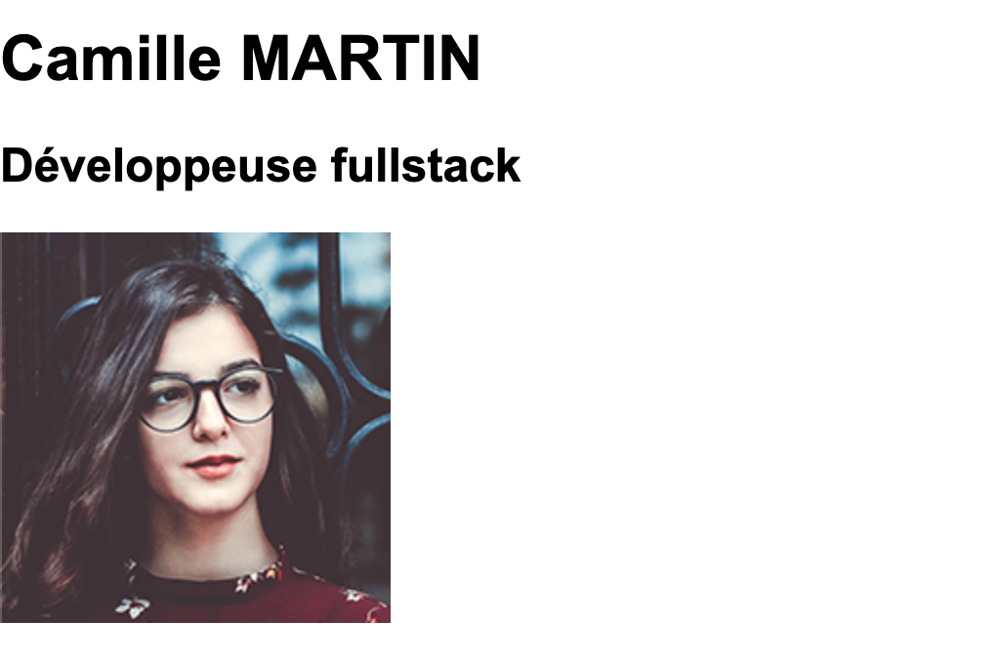
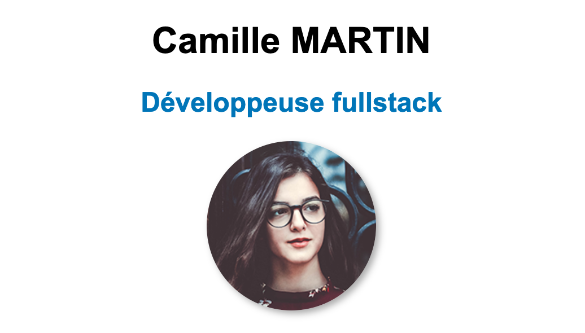
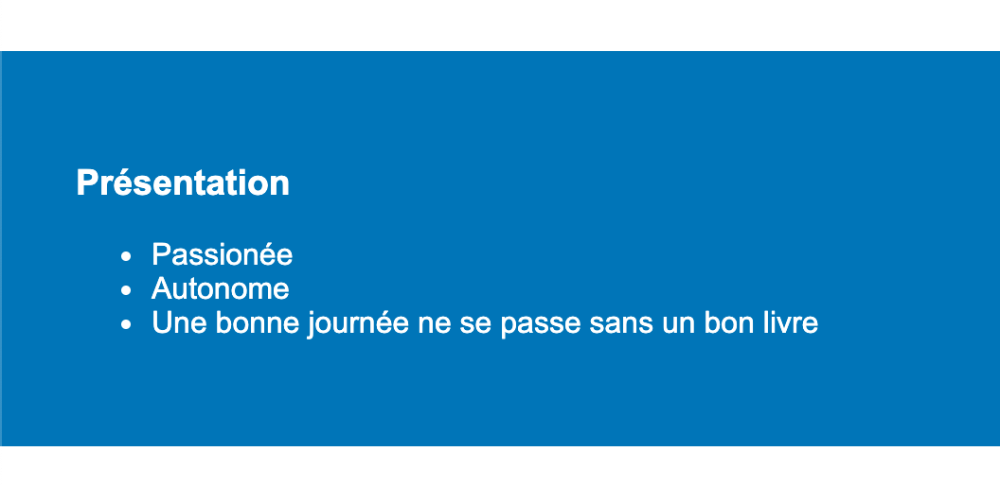
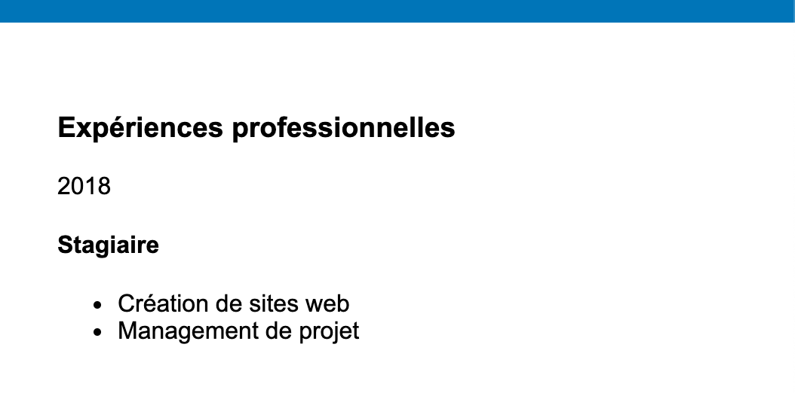
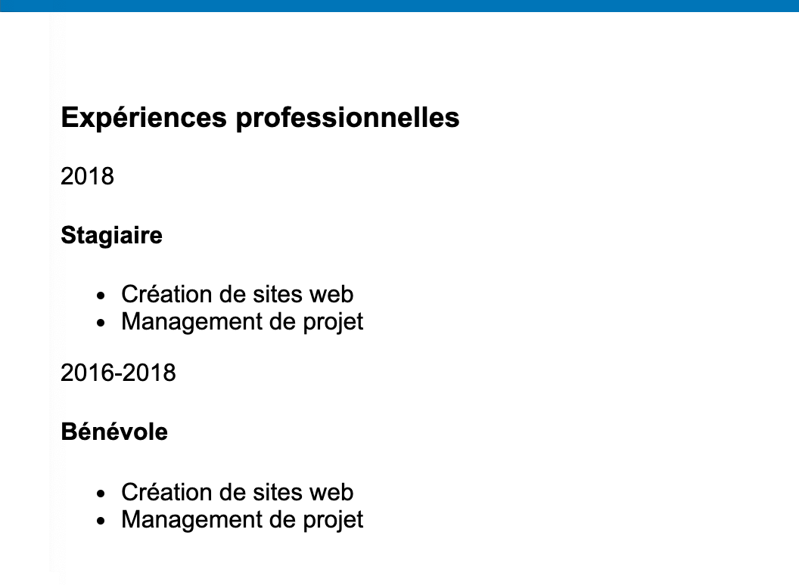
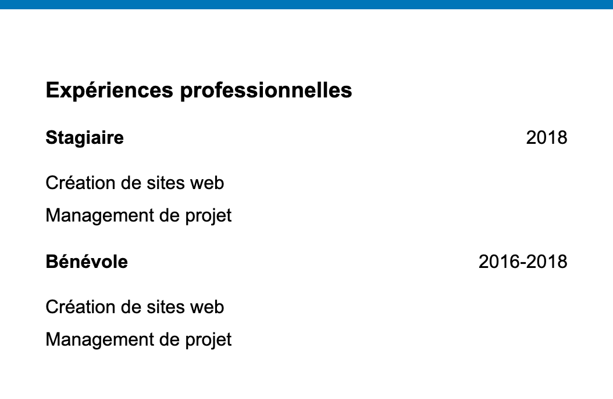
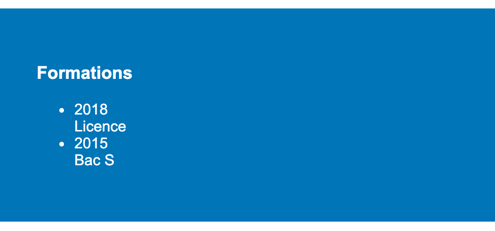
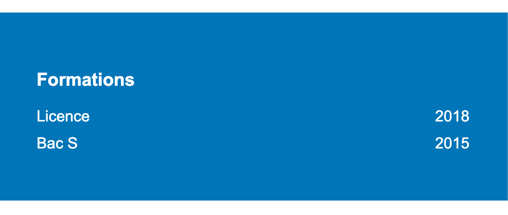
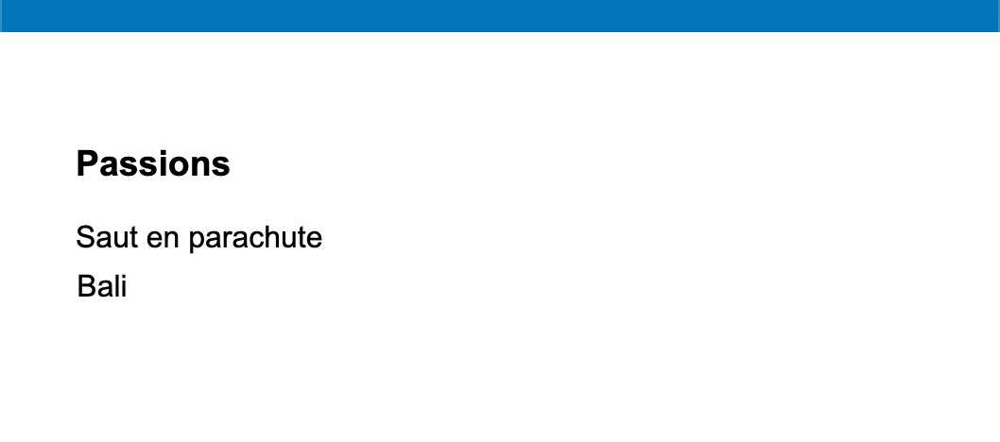

uu# Sessions 5 à 8 : Écrire un CV en HTML et CSS pour le publier en ligne

## Attention

**Il faut suivre les instructions telles quelles. Une fois le CV fini, vous pourrez changer le CV avec votre texte et votre photo.**

## Liens vers les étapes

  - [Étape 1 - Structure HTML de base](#%c3%89tape-1---structure-html-de-base)
    - [Vérification - Étape 1](#v%c3%a9rification---%c3%89tape-1)
  - [Étape 2 - Métadonnées](#%c3%89tape-2---m%c3%a9tadonn%c3%a9es)
    - [Vérification - Étape 2](#v%c3%a9rification---%c3%89tape-2)
  - [Étape 3 - Structure CSS](#%c3%89tape-3---structure-css)
    - [Vérification - Étape 3](#v%c3%a9rification---%c3%89tape-3)
  - [Étape 4 - Liens de navigation interne](#%c3%89tape-4---liens-de-navigation-interne)
    - [Vérification - Étape 4](#v%c3%a9rification---%c3%89tape-4)
  - [Étape 5 - Style des liens de navigation interne](#%c3%89tape-5---style-des-liens-de-navigation-interne)
    - [Vérification - Étape 5](#v%c3%a9rification---%c3%89tape-5)
  - [Étape 6 - En-tête du CV](#%c3%89tape-6---en-t%c3%aate-du-cv)
    - [Vérification - Étape 6](#v%c3%a9rification---%c3%89tape-6)
  - [Étape 7 - Style de l'en-tête](#%c3%89tape-7---style-de-len-t%c3%aate)
    - [Vérification - Étape 7](#v%c3%a9rification---%c3%89tape-7)
  - [Étape 8 - Présentation de la personne](#%c3%89tape-8---pr%c3%a9sentation-de-la-personne)
    - [Vérification - Étape 8](#v%c3%a9rification---%c3%89tape-8)
  - [Étape 9 - Style de la présentation](#%c3%89tape-9---style-de-la-pr%c3%a9sentation)
    - [Vérification - Étape 9](#v%c3%a9rification---%c3%89tape-9)
  - [Étape 10 - Expériences professionnelles (Partie 1/2)](#%c3%89tape-10---exp%c3%a9riences-professionnelles-partie-12)
    - [Vérification - Étape 10](#v%c3%a9rification---%c3%89tape-10)
  - [Étape 11 - Expériences professionnelles (Partie 2/2)](#%c3%89tape-11---exp%c3%a9riences-professionnelles-partie-22)
    - [Vérification - Étape 11](#v%c3%a9rification---%c3%89tape-11)
  - [Étape 12 - Style des expériences professionnelles](#%c3%89tape-12---style-des-exp%c3%a9riences-professionnelles)
    - [Vérification - Étape 12](#v%c3%a9rification---%c3%89tape-12)
  - [Étape 13 - Formations](#%c3%89tape-13---formations)
    - [HTML pour la section _Formations_](#html-pour-la-section-formations)
    - [CSS pour la section _Formations_](#css-pour-la-section-formations)
    - [Vérification - Étape 13](#v%c3%a9rification---%c3%89tape-13)
  - [Étape 14 - Passions](#%c3%89tape-14---passions)
    - [Vérification - Étape 14](#v%c3%a9rification---%c3%89tape-14)
  - [Étape 15 - Bas de page](#%c3%89tape-15---bas-de-page)
    - [Vérification - Étape 15](#v%c3%a9rification---%c3%89tape-15)
  - [Étape 16 - Style du bas de page](#%c3%89tape-16---style-du-bas-de-page)
    - [Vérification - Étape 16](#v%c3%a9rification---%c3%89tape-16)
  - [Étape 17 - Personnalisation du CV](#%c3%89tape-17---personnalisation-du-cv)
  - [Étape 18 - Publication du CV sur Internet](#%c3%89tape-18---publication-du-cv-sur-internet)

## Étape 1 - Structure HTML de base

**But de l'étape :** Construire une base valide pour votre document HTML.

- Créer un fichier `index.html` s'il n'existe pas.
- Écrire le doctype pour un fichier HTML5 sur la première ligne : `<!DOCTYPE html>`.
- Sur la ligne suivante, écrire la balise `<html>`.
- À l'intérieur de l'élément `<html>` :
  - Écrire la balise `<head>`.
  - Écrire la balise `<body>` en dessous avec le texte `Bonjour` à l'intérieur.

### Vérification - Étape 1

Avant de passer à l'étape suivante, allez sur le navigateur et vérifiez que le texte `Bonjour` s'affiche.
Si non, appelez un assistant ou regardez la solution pour vous aider.

<details>
    <summary>👀 Solution</summary>

```html
<!DOCTYPE html>
<html>
  <head> </head>
  <body>
    Bonjour
  </body>
</html>
```

</details>

## Étape 2 - Métadonnées

**But de l'étape :** Donner un titre à votre document et indiquer au navigateur quel [encodage](https://developer.mozilla.org/fr/docs/Glossaire/codage_caracteres) utiliser pour votre texte.

Dans l'élément `<head>` :

- Écrire une balise auto-fermante `<meta>` avec l'attribut `charset` et la valeur `utf8`.
- Écrire une balise `<title>` avec le texte `CV de Camille`.

### Vérification - Étape 2

Avant de passer à l'étape suivante, allez sur le navigateur, rechargez la page et regardez si l'onglet a le titre `CV de Camille`.

<details>
    <summary>👀 Solution</summary>

```html
<head>
  <meta charset="utf8" />
  <title>CV de Camille</title>
</head>
```

</details>

## Étape 3 - Structure CSS

**But de l'étape :** Ajouter une feuille de style à votre document.

- Créer le fichier `style.css` à côté du fichier `index.html` s'il n'existe pas.
- Dans `style.css`, écrire les règles suivantes pour l'élément `<body>` :
  - Appliquer la police de caractères `Arial` avec la propriété `font-family`.
  - Réduire les marges extérieures à `0` avec la propriété `margin`.
- Dans `index.html` :
  - Dans l'élément `<head>`, écrire une balise `<link>` pour lier le fichier CSS créé à l'instant.

### Vérification - Étape 3

Avant de passer à l'étape suivante, vérifiez que le texte `Bonjour` a changé de police. Si non, appelez un assistant ou regardez la solution pour vous aider.

<details>
    <summary>👀 Solution</summary>

Dans `style.css` :

```css
body {
  font-family: Arial;
  margin: 0;
}
```

Dans `index.html` :

```html
<head>
  <link rel="stylesheet" href="style.css" />
</head>
```

</details>

## Étape 4 - Liens de navigation interne

**But de l'étape :** Créer des ancres qui permettront aux visiteurs de se déplacer instantanément vers les sections de leur choix.

Dans le fichier `index.html`, à l'intérieur de l'élément `<body>` :

- Effacer le texte `Bonjour`.
- Écrire une balise `<nav>` avec la classe `secondary-block`.
- À l'intérieur de l'élément `<nav>`, écrire une balise `<h2>` avec le texte `Camille MARTIN`.
- Après le titre `<h2>`, écrire une liste `<ul>` contenant 3 items `<li>`.
- Dans chacun de ces 3 items `<li>`, écrire une balise `<a>`.
  1. Ajouter au premier élément `<a>` un attribut `href` avec la valeur `#profile` et le texte `Profil`
  2. Ajouter au second élément `<a>` un attribut `href` avec la valeur `#xp` et le texte `Expériences`.
  3. Ajouter au troisième élément `<a>` un attribut `href` avec la valeur `#education` et le texte `Formations`.

### Vérification - Étape 4

Avant de passer à l'étape suivante, vérifiez que le texte `Camille MARTIN` apparaît en gras et les textes `Profil`, `Expériences` et `Formations` ont des puces sur leur gauche. Si non, appelez un assistant ou regardez la solution pour vous aider.


<details>
    <summary>👀 Solution</summary>

```html
<nav class="secondary-block">
  <h2>Camille MARTIN</h2>
  <ul>
    <li><a href="#profile">Profil</a></li>
    <li><a href="#xp">Expériences</a></li>
    <li><a href="#education">Formations</a></li>
  </ul>
</nav>
```

</details>

## Étape 5 - Style des liens de navigation interne

**But de l'étape :** Changer le style de la section contenant les liens de navigation pour que tout soit aligné et suive le thème du CV.

Dans le fichier `style.css` :

- Écrire des règles pour l'élément `<nav>` qui lui donnent une hauteur de `70` pixels et changent son affichage (`display`) en conteneur flexible (valeur `flex`).
- Écrire des règles pour la classe `secondary-block` qui changent sa couleur de texte en blanc et change sa couleur de fond avec la valeur `rgb(4, 117, 186)`.
- Écrire une règle pour les éléments `<a>` qui change leur couleur en blanc.
- Écrire les règles suivantes pour l'élément `<h2>` enfant de `<nav>` :
  - Des marges extérieures (`margin`) à `0`.
  - Des marges intérieures (`padding`) avec :
    - `20` pixels en haut.
    - `0` à droite.
    - `20` pixels en bas.
    - `15` pixels à gauche.
- Écrire les règles suivantes pour l'élément `<ul>` enfant de `<nav>` :
  - Un affichage (`display`) en mode `flex`.
  - Des marges extérieures à `0`.
  - Des marges intérieures à `24` pixels.
  - Supprimer les puces de la liste avec la propriété `list-style`.
- Écrire une règle pour les éléments `<li>` enfants de `<nav>` qui change leur marge extérieure gauche à `15` pixels.

### Vérification - Étape 5

Avant de passer à l'étape suivante, vérifiez que le fond est bleu, le texte est blanc et les liens sont alignés.
Si non, appelez un assistant ou regardez la solution pour vous aider.


<details>
    <summary>👀 Solution</summary>

```css
a {
  color: rgb(255, 255, 255);
}

.secondary-block {
  color: rgb(255, 255, 255);
  background-color: rgb(4, 117, 186);
}

nav {
  display: flex;
  height: 70px;
}

nav h2 {
  padding: 20px 0 20px 15px;
  margin: 0;
}

nav ul {
  display: flex;
  margin: 0;
  list-style: none;
  padding: 24px;
}

nav li {
  margin-left: 15px;
}
```

</details>

## Étape 6 - En-tête du CV

Dans le fichier `index.html` :

- Écrire une balise `<header>` après l'élément `<nav>`, avec à l'intérieur :
  - Une balise `<div>` avec la classe `content`.
  - À l'intérieur de ce `<div>` :
    - Écrire une balise `<h1>` avec le texte `Camille MARTIN`.
    - Écrire une balise `h2` avec le texte `Développeuse fullstack`
    - Écrire la balise qui permet d'afficher l'image `camille_martin.png`.

### Vérification - Étape 6

Avant de passer à l'étape suivante, vérifiez que le nom est plus grand que le métier et que la photo apparaît. Si non, appelez un assistant ou regardez la solution pour vous aider.



<details>
    <summary>👀 Solution</summary>

```html
<header>
  <div class="content">
    <h1>Camille MARTIN</h1>
    <h2>Développeuse fullstack</h2>
    
  </div>
</header>
```

</details>

## Étape 7 - Style de l'en-tête

Dans le fichier `style.css` :

- Écrire les règles suivantes pour l'élément `<header>` :
  - Centrer tous les textes à l'intérieur.
  - Ajouter des marges intérieures de `40` pixels.
- Écrire les règles suivantes pour la classe `content` :
  - Définir une largeur maximale de `800` pixels avec la propriété `max-width`.
  - Centrer le reste du contenu avec la propriété `margin` et la valeur `0 auto`.
- Écrire une règle pour l'élément `<h2>` enfant de `<header>` qui change la couleur du texte en bleu avec `rgb(4, 117, 186)`.
- Écrire les règles suivantes pour l'image enfant de l'élément `<header>` :
  - Une largeur de `150` pixels.
  - Arrondir l'image avec la propriété `border-radius` et une valeur de `75` pixels (la moitié de la largeur).
  - Donner une ombre légère à l'image avec la propriété `box-shadow` et la valeur `3px 3px 6px rgb(170, 170, 170)`. Si vous avez du mal à voir l'ombre, vous pouvez la rendre plus sombre en diminuant les valeurs de `rgb`.

### Vérification - Étape 7

Avant de passer à l'étape suivante, vérifiez que le nom est en noir, le métier en bleu et l'image est ronde avec une ombre. Si non, appelez un assistant ou regardez la solution pour vous aider.



<details>
  <summary>👀 Solution</summary>

```css
header {
  text-align: center;
  padding: 40px;
}

.content {
  max-width: 800px;
  margin: 0 auto;
}

header h2 {
  color: rgb(4, 117, 186);
}

header img {
  width: 150px;
  border-radius: 75px;
  box-shadow: 3px 3px 6px rgb(170, 170, 170);
}
```

</details>

## Étape 8 - Présentation de la personne

Dans le fichier `index.html` :

- Écrire une balise `<section>` après l'élément `<header>` avec un ID `profile` (du même nom de l'ancre dans la navigation) et une classe `secondary-block`
- À l'intérieur de cette section, écrire une balise `<div>` avec la classe `content`.
- À l'intérieur de ce `<div>` :
  - Écrire une balise `<h3>` avec le texte `Présentation`.
  - Écrire une balise `<ul>` avec 3 enfants `<li>` contenant le texte affiché dans l'image ci-dessous.


### Vérification - Étape 8

Avant de passer à l'étape suivante, vérifiez que tous les textes de l'image sont visibles. Si non, appelez un assistant ou regardez la solution pour vous aider.

<details>
    <summary>👀 Solution</summary>

```html
<section id="profile" class="secondary-block">
  <div class="content">
    <h3>Présentation</h3>
    <ul>
      <li>Passionée</li>
      <li>Autonome</li>
      <li>Une bonne journée ne se passe sans un bon livre</li>
    </ul>
  </div>
</section>
```

</details>

## Étape 9 - Style de la présentation

Dans le fichier `style.css` :

- Écrire une règle pour que les éléments `<section>` aient des marges intérieures de `40` pixels.

C'est tout. Grâce au CSS déjà créé dans les étapes précédentes, il n'y a rien d'autres à ajouter.

### Vérification - Étape 9

Avant de passer à l'étape suivante, vérifiez que la page ressemble à l'image ci-dessous. Si non, appelez un assistant ou regardez la solution pour vous aider.



<details>
    <summary>👀 Solution</summary>

```css
section {
  padding: 40px;
}
```

</details>

## Étape 10 - Expériences professionnelles (Partie 1/2)

Dans le fichier `index.html` :

- Sous la dernière section, écrire une autre balise `<section>` avec un ID `xp`, comme dans un des liens de navigation en haut de la page.
- À l'intérieur de cette nouvelle section, écrire une balise `<div>` avec une classe `content`.
- À l'intérieur de ce `<div>` :
  - Écrire une balise `<h3>` avec le texte `Expériences professionnelles`.
  - Écrire une balise `<div>` avec à l'intérieur :
    - Une balise `<aside>` avec le texte `2018`.
    - Une balise `<h4>` avec le texte `Stagiaire`.
    - Une balise `<ul>` avec 2 enfants `<li>` et les textes de l'image ci-dessous.



### Vérification - Étape 10

Avant de passer à l'étape suivante, vérifiez que la page ressemble à l'image ci-dessus. Si non, appelez un assistant ou regardez la solution pour vous aider.

<details>
    <summary>👀 Solution</summary>

```html
<section id="xp">
  <div class="content">
    <h3>Expériences professionnelles</h3>
    <div>
      <aside>2018</aside>
      <h4>Stagiaire</h4>
      <ul>
        <li>Création de sites web</li>
        <li>Management de projet</li>
      </ul>
    </div>
  </div>
</section>
```

</details>

## Étape 11 - Expériences professionnelles (Partie 2/2)

Dans le fichier `index.html` :

- En faisant attention à l'indentation, écrire une nouvelle balise `<div>` dans le `<div>` ayant la classe `content`.
- À l'intérieur de ce nouveau `<div>`, ajouter des balises `<aside>`, `<h4>` et `<ul>`, comme dans l'étape précédente.
- Reprendre les textes de l'image ci-dessous pour le contenu de ces balises.



### Vérification - Étape 11

Avant de passer à l'étape suivante, vérifiez que la page ressemble à l'image ci-dessus. Si non, appelez un assistant ou regardez la solution pour vous aider.

<details>
    <summary>👀 Solution</summary>

```html
<section id="xp">
  <div class="content">
    <h3>Expériences professionnelles</h3>
    <div>
      <aside>2018</aside>
      <h4>Stagiaire</h4>
      <ul>
        <li>Création de sites web</li>
        <li>Management de projet</li>
      </ul>
    </div>
    <div>
      <aside>2016-2018</aside>
      <h4>Bénévole</h4>
      <ul>
        <li>Création de sites web</li>
        <li>Management de projet</li>
      </ul>
    </div>
  </div>
</section>
```

</details>

## Étape 12 - Style des expériences professionnelles

Dans le fichier `style.css` :

- Écrire les règles suivantes pour les éléments `<ul>` enfants de l'élément ayant l'ID `xp` :
  - Mettre des marges intérieures et extérieures à `0`.
  - Supprimer les puces des listes.
- Écrire une règle pour les éléments `<li>` enfants de l'élément ayant l'ID `xp` qui leur donne une marge extérieure de `10` pixels en bas.
- Écrire une règle pour les éléments `<aside>` enfants de l'élément ayant l'ID `xp` qui les place à droite du document avec la propriété `float` et la valeur `right`.



### Vérification - Étape 12

Avant de passer à l'étape suivante, vérifiez que la page ressemble à l'image. Si non, appelez un assistant ou regardez la solution pour vous aider.

<details>
    <summary>👀 Solution</summary>

```css
#xp ul {
  list-style: none;
  padding: 0;
  margin: 0;
}

#xp li {
  margin-bottom: 10px;
}

#xp aside {
  float: right;
}
```

</details>

## Étape 13 - Formations

**La présentation entre la section _Expériences_ et _Formations_ est très similaire.**

### HTML pour la section _Formations_

Sans instructions précises et en vous inspirant du code que vous avez déjà produit, écrivez la structure HTML qui ressemblera à l'image ci-dessous.



### CSS pour la section _Formations_

Sans instructions précises et en vous inspirant du code que vous avez déjà produit, écrivez les règles CSS qui appliqueront le style correspondant à l'image ci-dessous.



### Vérification - Étape 13

Avant de passer à l'étape suivante, vérifiez que la page ressemble à l'image ci-dessus. Si non, appelez un assistant ou regardez la solution pour vous aider.

<details>
    <summary>👀 Solution</summary>

```html
<section id="education" class="secondary-block">
  <div class="content">
    <h3>Formations</h3>
    <ul>
      <li>
        <aside>2018</aside>
        Licence
      </li>
      <li>
        <aside>2015</aside>
        Bac S
      </li>
    </ul>
  </div>
</section>
```

```css
#education ul {
  list-style: none;
  padding: 0;
  margin: 0;
}

#education li {
  margin-bottom: 10px;
}

#education aside {
  float: right;
}
```

</details>

## Étape 14 - Passions

Dans le fichier `index.html` :

- Écrire une balise `<section>` avec un `<div>` de classe `content` à l'intérieur.
- À l'intérieur de ce `<div>`, écrire les balises suivantes :
  - Un `<h3>` avec le texte `Passions`.
  - Un `<p>` avec le texte `Saut en parachute`.
  - Un `<p>` avec le texte `Bali`.

Vous n'avez pas besoin d'ajouter du CSS pour cette étape car le style écrit avant s'applique ici par effet de cascade.



### Vérification - Étape 14

Avant de passer à l'étape suivante, vérifier que la page ressemble à l'image.
Si non, appeler un assistant et/ou regarder la solution pour vous aider.

<details>
    <summary>👀 Solution</summary>

```html
<section>
  <div class="content">
    <h3>Passions</h3>
    <p>Saut en parachute</p>
    <p>Bali</p>
  </div>
</section>
```

</details>

## Étape 15 - Bas de page

Dans le fichier `index.html` :

- Après le dernier élément `<section>`, écrire une balise `<footer>` avec la classe `secondary-block`.
- À l'intérieur de ce `<footer>`, écrire une balise `<div>` avec la classe `content`.
- À l'intérieur de ce `<div>`, écrire une autre balise `<div>` avec la classe `links`.
- Dans ce second `<div>`, écrire une balise `<ul>` avec 2 enfants `<li>` qui contiendront 2 ancres avec des attributs `href` de valeurs `#`.
- Mettre les textes correspondants à l'image ci-dessous dans les ancres.
- Reproduire la même structure pour les 2 ancres du bas.


### Vérification - Étape 15

Avant de passer à l'étape suivante, vérifiez que la page ressemble à l'image ci-dessus. Si non, appelez un assistant ou regardez la solution pour vous aider.

<details>
    <summary>👀 Solution</summary>

```html
<footer class="secondary-block">
  <div class="content">
    <div class="links">
      <ul>
        <li><a href="http://konexio.eu">Voyage</a></li>
        <li><a href="http://konexio.eu">Tech</a></li>
      </ul>
    </div>
    <div class="links">
      <ul>
        <li><a href="http://konexio.eu">LinkedIn</a></li>
        <li><a href="http://konexio.eu">Twitter</a></li>
      </ul>
    </div>
  </div>
</footer>
```

</details>

## Étape 16 - Style du bas de page

Dans le fichier `style.css` :

- Écrire une règle pour l'élément `<footer>` qui lui applique des marges intéreures de `40` pixels.
- Écrire les règles suivantes pour les éléments `<ul>` enfants de `<footer>` :
  - Des marges intérieures à `0`.
  - Des marges extérieures à `0`.
  - Supprimer les puces des listes.les puces de listes
- Écrire les règles suivantes pour les éléments ayant la classe `links` :
  - Une marge extérieure en bas de `25` pixels.
  - Une largeur de `390` pixels.
  - Un affichage en `inline-block`.


### Vérification - Étape 16

Avant de passer à l'étape suivante, vérifiez que la page ressemble aux images en version mobile (haut) et desktop (bas). Si non, appelez un assistant ou regardez la solution pour vous aider.

<details>
    <summary>👀 Solution</summary>

```css
footer {
  padding: 40px;
}

footer ul {
  list-style: none;
  padding: 0;
  margin: 0;
}

.links {
  margin-bottom: 25px;
  display: inline-block;
  width: 390px;
}
```

</details>

## Étape 17 - Personnalisation du CV

Changez le texte et les couleurs du CV à votre goût pour le personnaliser.

## Étape 18 - Publication du CV sur Internet

Votre page est terminée, il est temps de la publier en ligne.

- Allez sur le site [GitHub](https://github.com/)
  - Connectez-vous avec votre compte.
  - Si vous n'avez pas de compte GitHub :
    - Créez un compte.
    - Validez votre inscription avec le lien reçu dans votre boîte email.
- Téléchargez [GitHub Desktop](https://desktop.github.com/), installez-le et connectez-vous à cette application avec vos identifiants GitHub.
- Revenez sur GitHub dans votre navigateur et cliquez sur l'icône "+" en haut à droite et cliquez sur `New repository`.
  - Dans le champ `Repository name`, écrivez `<username>.github.io` où `<username>` sera le nom de votre compte GitHub (le même qui apparaît dans la partie `Owner`).
  - Pas de `description` nécessaire.
  - Gardez la visibilité en `Public`.
  - Laissez la case `Initialize this repository with a README` décochée.
  - Cliquez sur `Create repository`.
- Une fois créée, une nouvelle page s'affichera et cliquez sur le bouton à gauche `Set up in desktop` et l'application GitHub Desktop va s'ouvrir.
  - Cliquez sur le lien `Open this repository` dans la fenêtre centrale et une fenêtre de l'explorateur Windows s'ouvrira.
  - Copiez tout votre projet dans ce dossier.
- Revenez sur GitHub Desktop, ajoutez le texte `First commit` dans le champ `Summary` et cliquez sur `Commit to master`.
  - Cliquez sur `Publish branch`.
  - Visitez le site `<username>.github.io` avec votre navigateur et partagez le lien avec vos ami.e.s !
